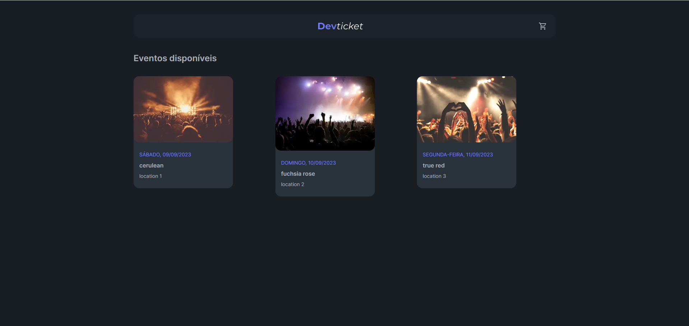
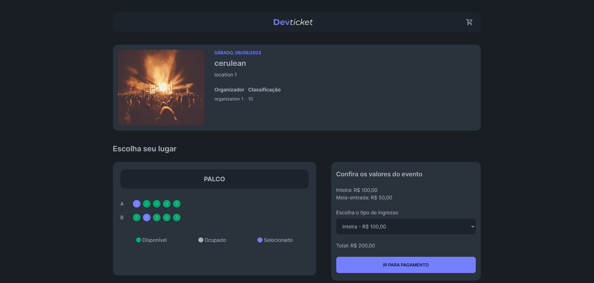
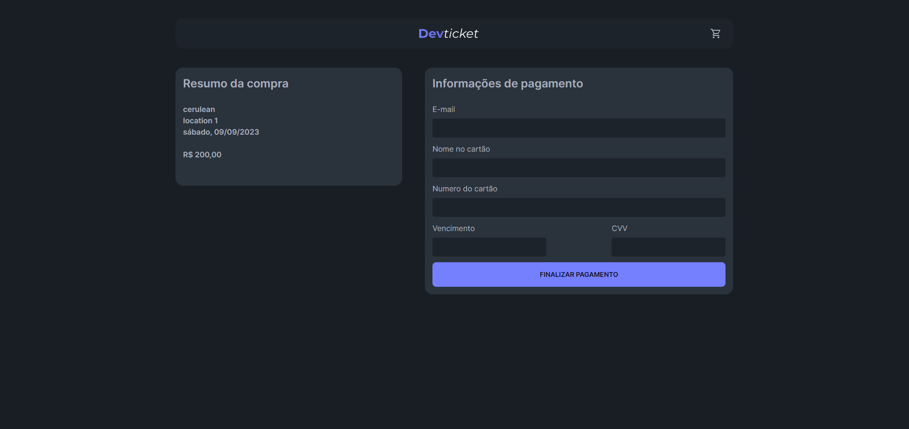

# Sistema de venda de ingressos (Imersão Fullcycle)

Projeto que visa a criação de um sistema de gerenciamento de vendas de ingressos desenvolvido durante o curso de imersão Full Cycle Dev, utilizando tecnologias como Nextjs, Nestjs, Golang e Kong. O sistema é constituído dos seguintes módulos:

- **Sistema de reserva de ingressos**: consiste no conjunto de APIs utilizadas pelos parceiros da plataforma para solicitar a reserva de ingressos. Foi construída utilizando o framework Nest.js e utiliza o PrismaORM para o gerenciamento dos bancos de dados da aplicação.

- **Frontend**: construído em Next.js, utilizando a abordagem de SSR (Server-Side Rendering), utilizando TailwindCSS para a estilização.

- **API de venda de ingressos**: construída em Golang, utilizando o design patern Repository Pattern que separa a camada de acesso aos dados da camada de regras de negócios.

- **Gateway de API**: construído usando Kong

  
  
    

